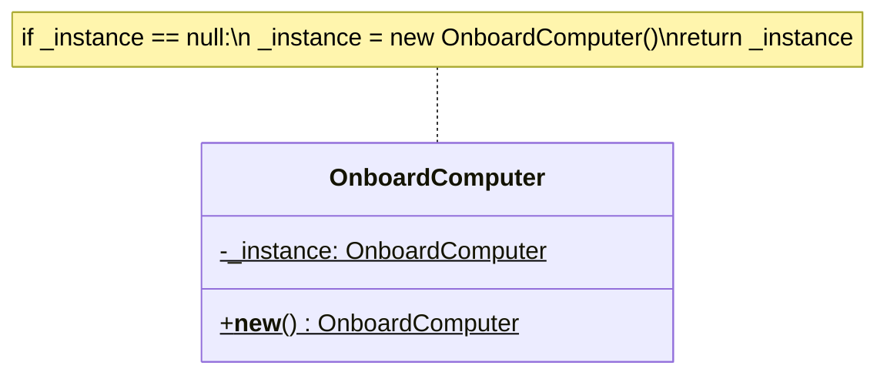
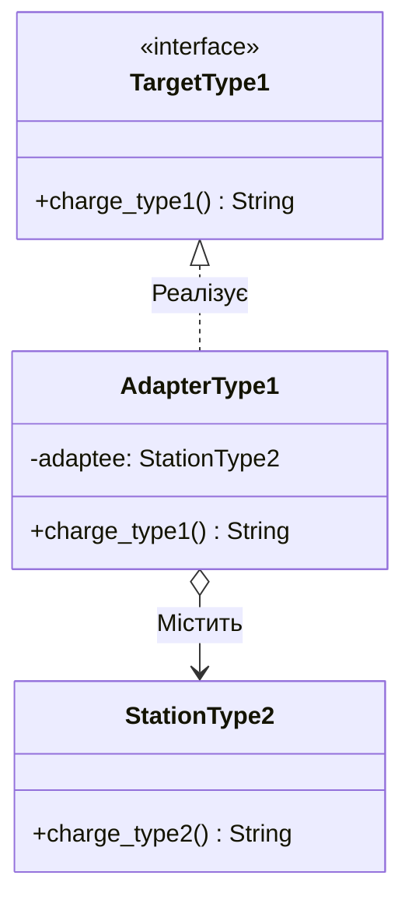
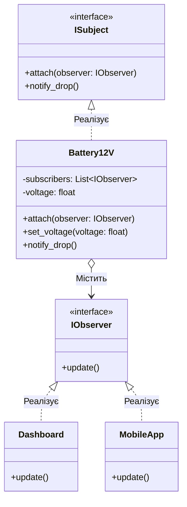

# Лабораторна робота №1: Design Patterns

**Мета:** Ознайомитися з основними шаблонами проєктування та продемонструвати їх практичне застосування.  
**Предметна область:** Системи електромобіля.

---

## 1. Породжувальний шаблон: Singleton 

* **Проблема:** Системою керування електромобіля (бортовим комп'ютером) має керувати лише один процес. Якщо випадково створити кілька екземплярів системи управління, вони можуть надсилати конфліктні команди.
* **Ідея реалізації:** Зробити так, щоб клас бортового комп'ютера міг мати лише один екземпляр, і надати до нього глобальну точку доступу.

* **UML-схема:**



* **Реалізація у коді:**

```python
class OnboardComputer:
    _instance = None

    def __new__(cls):
        if cls._instance is None:
            cls._instance = super().__new__(cls)
            print("Бортовий комп'ютер запущено. Ініціалізація систем...")
        return cls._instance

comp1 = OnboardComputer()
comp2 = OnboardComputer()
print(f"Чи це один і той самий об'єкт комп'ютера? {comp1 is comp2}")
```

* **Доцільність у реальних проєктах:** Менеджери конфігурацій, підключення до баз даних, системи логування, драйвери пристроїв.

---

## 2. Структурний шаблон: Adapter 

* **Проблема:** Зарядна станція видає струм через європейський конектор (Type 2), а електромобіль має американський зарядний порт (Type 1). Пряме підключення неможливе через різні інтерфейси.
* **Ідея реалізації:** Створити клас-перехідник, який реалізує очікуваний інтерфейс Type 1, але всередині викликає методи наявного конектора Type 2.

* **UML-схема:**



* **Реалізація у коді:**

```python
class StationType2:
    def charge_type2(self):
        return "Подаю струм через європейський роз'єм Type 2"

class AdapterType1(StationType2):
    def charge_type1(self):
        power = self.charge_type2()
        return f"{power} -> [Адаптер] -> Перетворено для американського роз'єму Type 1"

adapter = AdapterType1()
print("Підключаємо авто до станції через адаптер:")
print(adapter.charge_type1())
```

* **Доцільність у реальних проєктах:** Інтеграція старого коду з новими бібліотеками, робота з різними API, перетворення форматів даних (XML у JSON).

---

## 3. Поведінковий шаблон: Observer

* **Проблема:** Коли напруга 12-вольтового акумулятора критично падає, потрібно одночасно вивести помилку "Service EV System" на приладову панель і надіслати push-сповіщення у мобільний додаток водія.
* **Ідея реалізації:** Батарея (Видавець) веде список підписників (Панель, Додаток) і автоматично викликає їхній метод оновлення, коли напруга падає нижче норми.

* **UML-схема:**



* **Реалізація у коді:**

```python
class Battery12V:
    def __init__(self):
        self.subscribers = []
        self.voltage = 12.5

    def attach(self, sub):
        self.subscribers.append(sub)

    def set_voltage(self, voltage):
        self.voltage = voltage
        print(f"\n[Батарея] Поточна напруга: {self.voltage}V")
        if self.voltage < 11.5:
            self.notify_drop()

    def notify_drop(self):
        for sub in self.subscribers:
            sub.update()

class Dashboard:
    def update(self):
        print("[Приладова панель] Помилка: Service EV System!")

class MobileApp:
    def update(self):
        print("[Мобільний додаток] Push-сповіщення: Критично низький заряд 12V батареї!")


battery = Battery12V()
battery.attach(Dashboard())
battery.attach(MobileApp())

battery.set_voltage(12.0) 
battery.set_voltage(11.0) 
```

* **Доцільність у реальних проєктах:** Системи розсилки сповіщень, патерн MVC, відстеження подій у реальному часі.